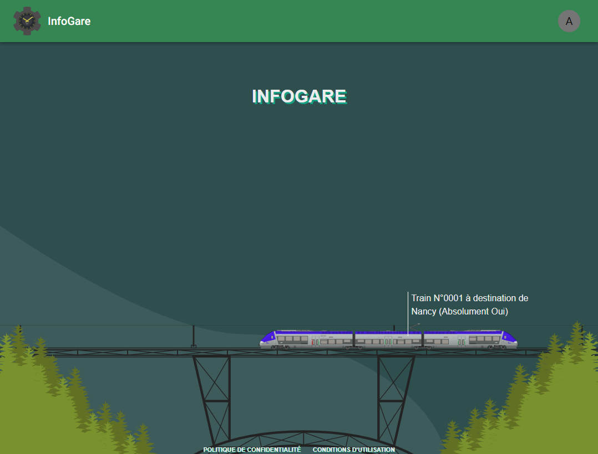
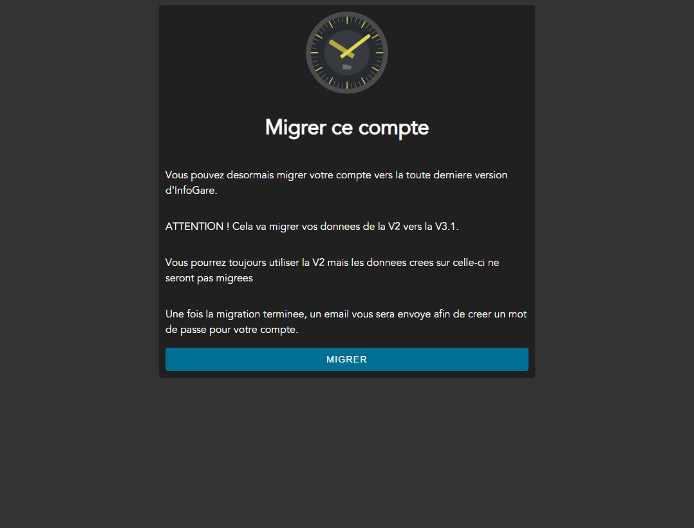

# V3.1, les festivités sont lancées !

## Intro

Ca y est ! La première partie de la tant attendue V3.1 d'InfoGare viens de sortir ! Nous allons vous en dire un peu plus dans cet article !

## Migrer depuis la V2

Dans cette première partie de la V3.1, nous avons essentiellement travaillé sur un système permettant de migrer depuis la V2. En effet, sur la page de connexion, vous disposez d'un bouton "Migrer depuis la V2" vous permettant de récupérer vos données depuis la dernière version stable d'InfoGare. Suivez les instructions de migrations et vous aurez accès à vos gares et trains dans la V3.1

Vous aurez toujours la possibilité de vous connecter sur la V2 (déplacée à l'adresse [https://v2.infogare.fr](https://v2.infogare.fr)) si jamais vous souhaitez bénéficier des anciennes fonctionnalités. A noter qu'une fois la migration effectuée, les données ajoutée/modifiées/supprimées sur la V2 ne seront pas synchronisées avec la V3.1.

## Pourquoi je ne peux pas accéder à mes gares RER et AFL ?

Chaque chose en son temps ! Nous avons décidé de sortir la V3.1 en plusieurs parties afin de vous garantir une expérience fluide et sans bugs. Cette première partie est dédiée à la création de la base de la nouvelle version, à la mise en place des gares classiques et à la migration depuis la V2. 

## A quand la suite ?

Nous vous avons concocté un petit calendrier des sorties des prochaines parties de la V3.1. Voici le calendrier prévisionnel :

::: warning Attention

Ce calendrier est sujet à changement. Il s'agit de dates approximatives !

:::

### 1. Partie 1 (Déjà sortie !) :

- Mise en place de la base de la V3.1
- Mise en place de la migration depuis la V2
- Mise en place des gares classiques

### 2. Partie 2 (Prévue pour le 01/06) :

- Mise en place des gares RER
- Correction d'éventuels bugs de la partie 1
- Mise en place de la duplication de gares et trains
- Début de la mise en place de l'API externe

### 3. Partie 3 (Prévue pour le 20/06) :

- Mise en place des gares AFL
- Correction d'éventuels bugs de la partie 2
- Mise en place du partage de gares et trains avec le public
- Mise en place de la mise à jour en temps réel des trains
- Mise en place de la gestion des dossiers de gares

### 4. Partie 4 (Prévue pour le 01/07) :

- Mise en place des affichages EVA
- Correction d'éventuels bugs de la partie 3
- Mise en place du tableau de bord
- Fin de la mise en place de l'API externe
- Création de projets autour de la V3.1 (voir [ici](/posts/InfoGare/V3.html#ce-qui-va-arriver-dans-le-courant-de-lannee))

## J'ai des erreurs qui apparaissent !

Pas de panique ! InfoGare est actuellement en phase de test. Si jamais vous rencontrez des erreurs, n'hésitez pas à nous le faire savoir par mail à l'adresse [contact@infogare.fr](mailto:contact@infogare.fr) ou via nos réseaux sociaux !