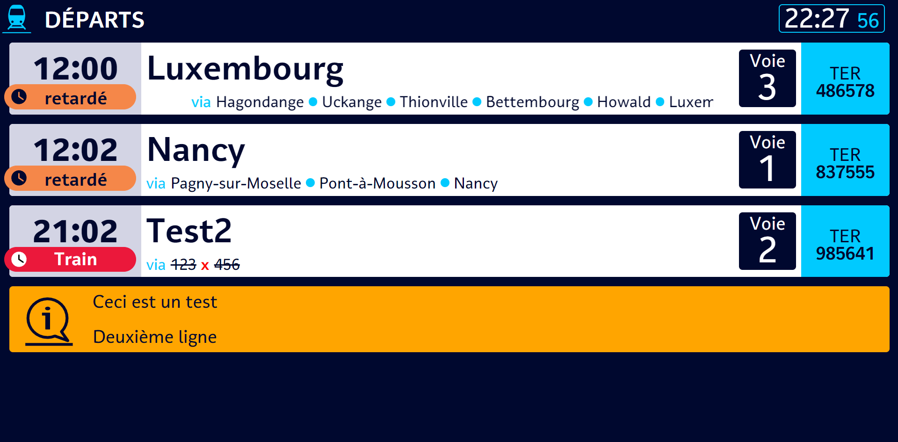
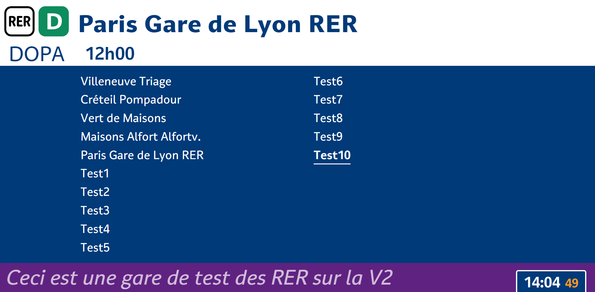
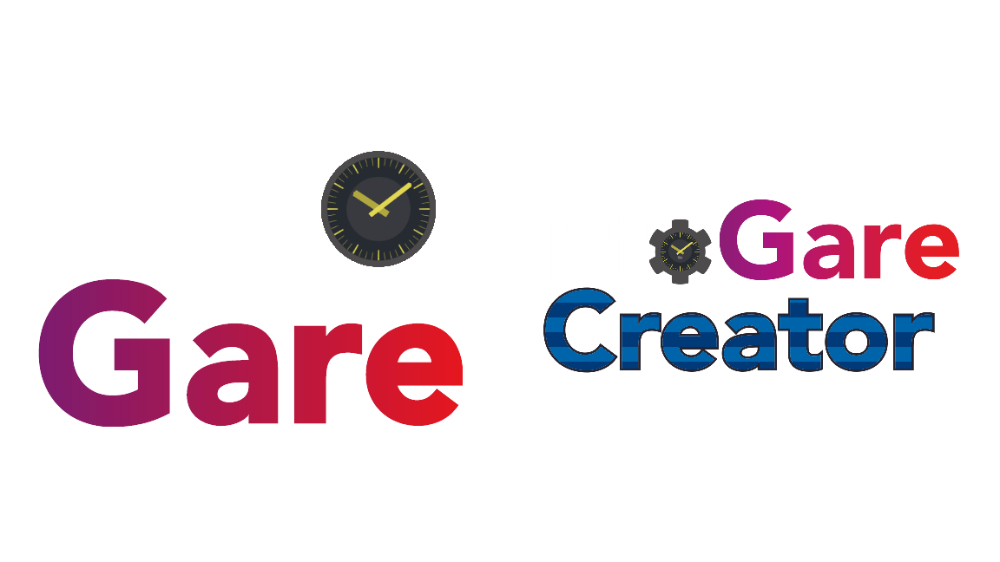

# La V3, enfin !

## Intro

Eh oui, après tant d'attente, la V3 d'InfoGare est enfin sortie ! Nous allons vous expliquer ce qui change et les nouveautés à venir dans l'année.

<!-- more -->

## Ce qui change par rapport à la V2

Tout d'abord, un changement stylistique était prévu pour la V3, une refonte complète de la charte graphique. Malheureusement, faute de temps, nous sommes restés sur un style très similaire à celui de la V2.

Dans cette V3, nous introduisons les affichages EVA, dont l'option était disponible dans les options de gares, mais dont l'affichage n'était pas encore terminé. Nous introduisone également les affichages RER, dont seuls les écrans de départs étaient présents dans la V2.

Des fonctionnalité également tant attendues : la mise à jour en temps réel des trains, avec le masquage auto une fois l'horaire dépassé. Le tri des gares par dossiers afin de pouvoir y voir plus clair. Le retour du partage de gares avec le public ainsi qu la duplication des gares et trains, déjà présents dans la V1, mais qui n'ont pas été réimplémentés dans la V2.

## Une séparation en deux versions

La V3 introduit également une séparation en deux versions : la version "classique", avec les horaires des trains SNCF en temps réel. Et la version Creator, qui était anciennement la version principale d'InfoGare.

**Pourquoi deux versions ?** Afin de toucher un public plus large qu'actuellement. Afin également de pouvoir afficher les horaires réels des trains.

**Et la version béta ?** La version béta est menée à disparaître d'ici peu, car il serait trop difficile de la maintenir en parallèle des deux versions du site.

## Ce qui va arriver dans le courant de l'année

Maintenant, un petit tour des fonctionnalités et des projets annexes.

### Une version locale d'InfoGare

En effet, nous sommes en train de travailler sur une version éxécutable en local. Elle sera composée d'un serveur, qui gérera le stockage des gares, trains, etc et qui gèrera les requêtes, et d'un client, qui effectuera les requêtes au serveur et affichera les gares, trains, etc. Cette version permettra d'utiliser InfoGare hors connexion, et de connecter plusieurs affichages en réseau local.

### Une API

Depuis un certain temps, nous imaginons une API d'InfoGare qui permettra aux développeurs d'intégrer InfoGare à leurs applications. Elle sera accessible sur demande et validation de l'équipe.

### Les affichages transiliens

Beaucoup d'utilisateurs demandent une implémentation des affichages transiliens. Nous y travaillons afin de pouvoir vous offrir une bonne expérience avec ces affichages.
